# Retain-Iq (Frontend Demo)

This is a **demo project** showcasing the frontend UI for RetainIQ.  
It includes dashboards, churn prediction views, funnel analysis, and insights — but **no backend integration**.

---
## ✨ Key Features
- 📊 Dashboard with user metrics  
- 🔮 Churn prediction (mock data)  
- 📈 Funnel analysis with drop-off detection  
- 🤖 AI insights (demo only)  
- 👥 User segmentation views  

---

## 💰 Pricing
This demo includes a **static pricing section** to showcase how SaaS plans could be displayed.  
- Free Tier (mock)  
- Pro Tier (mock)  
- Enterprise Tier (mock)  

---

## 📦 Product
Frontend pages for:
- Dashboard Overview  
- Funnel Analysis  
- Churn Prediction  
- AI Insights  
- Blog & Resources  
- Documentation  

## 📸 Screenshots

### Dashboard Overview
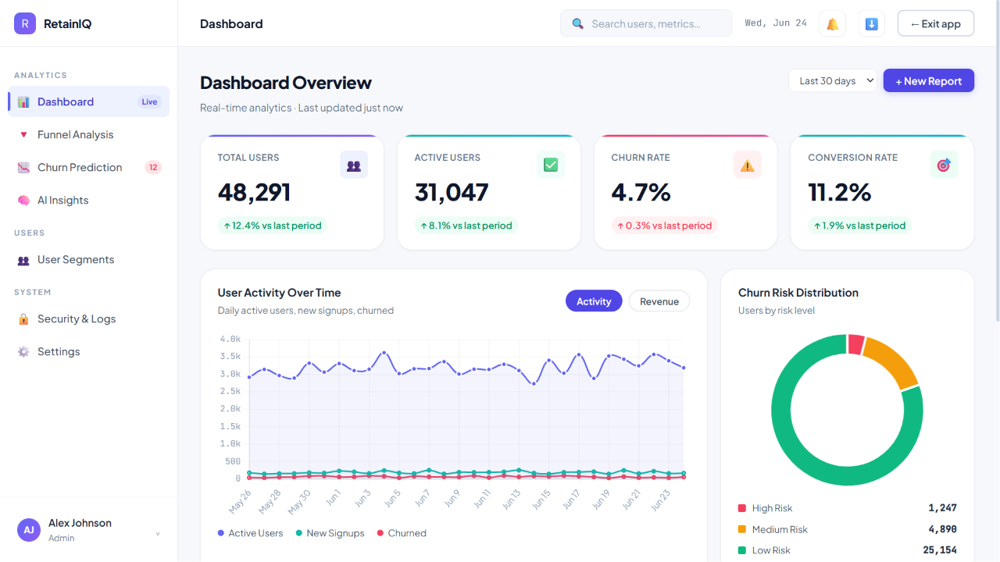
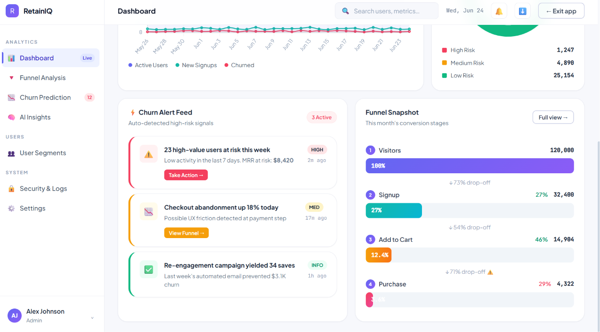

### Funnel Analysis

### Churn Prediction
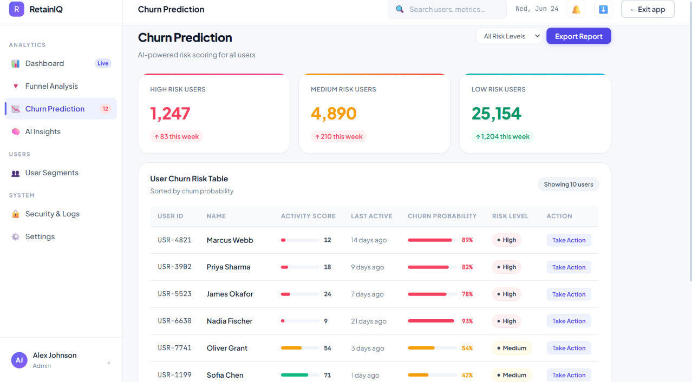

### AI Insights
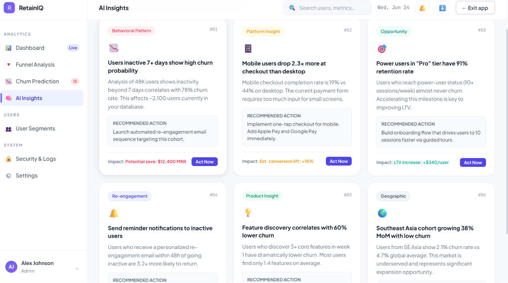

### User Segments
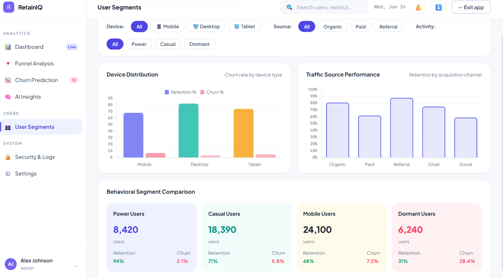

### Security & Logs
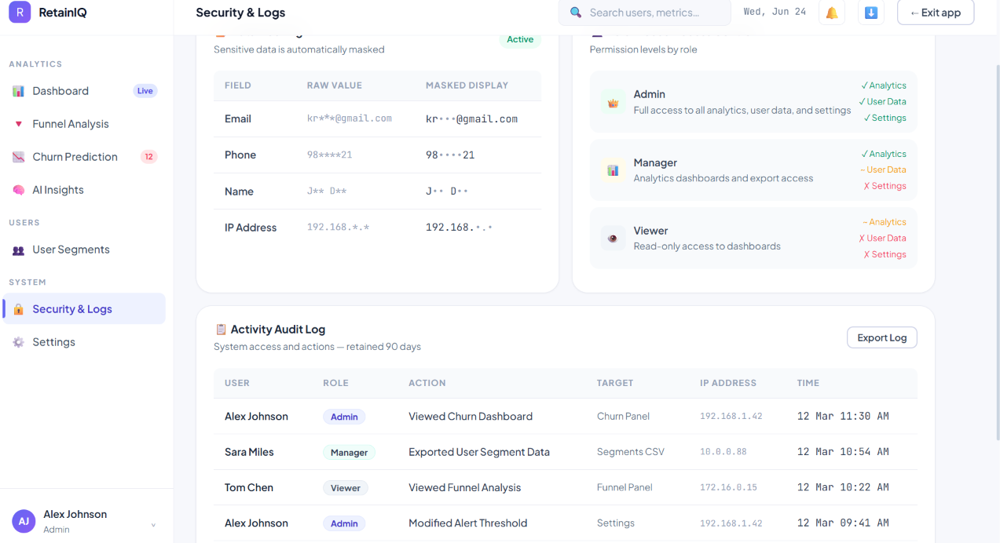

### Blog & Resources
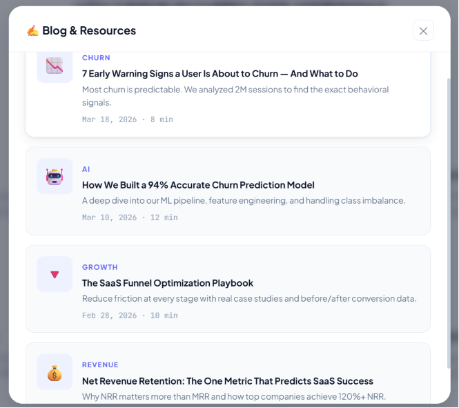

### Documentation
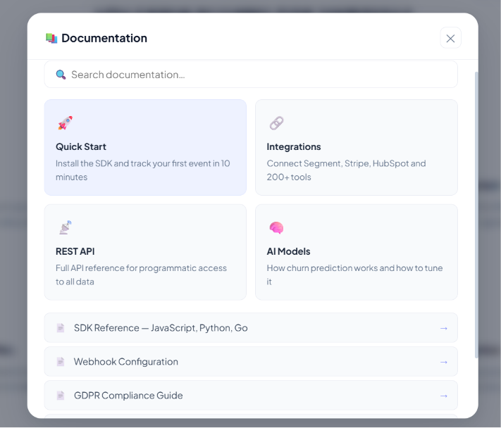

### 🏠 Home Page
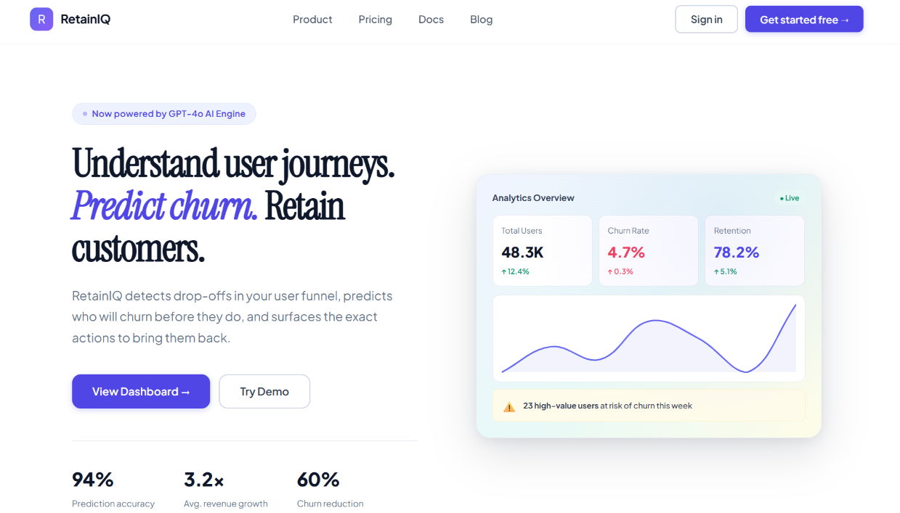

### ✨ Key Features

### 💰 Pricing
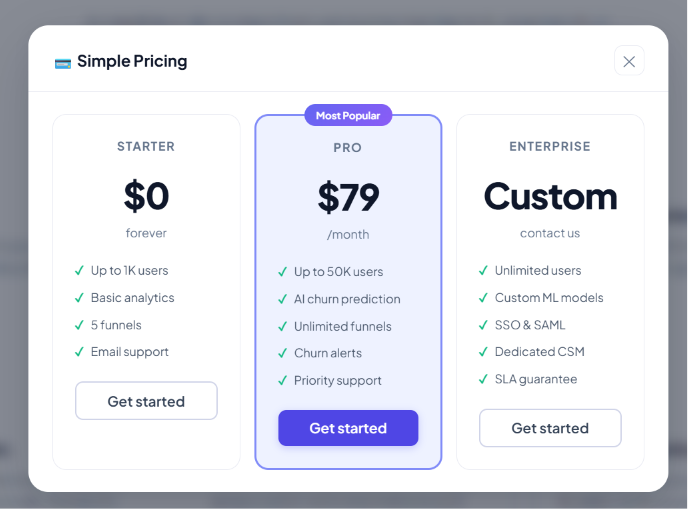

### 📦 Product
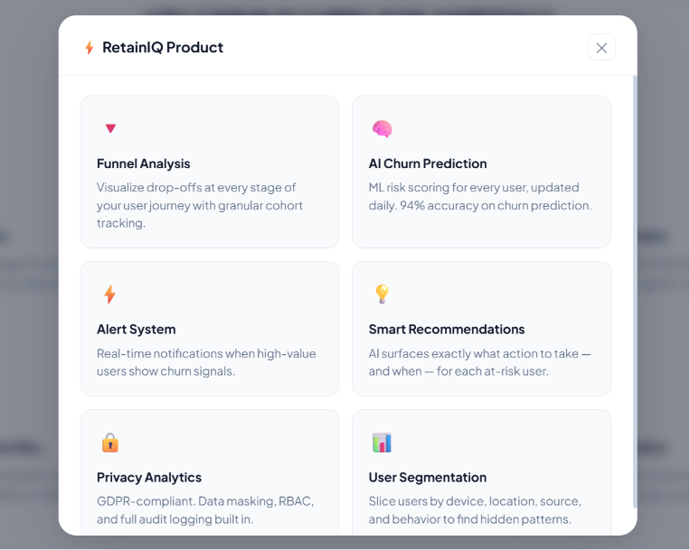

---

## 🚀 Tech Stack
- HTML, CSS, JavaScript
- Responsive UI components
- Demo data only (no backend)

---

## 📌 Description
This project demonstrates:
- Clean and modern analytics dashboard design
- Churn prediction and funnel visualization (mock data)
- User‑friendly layout for SaaS analytics

⚠️ **Note:** This is only a demo frontend project. No real data or backend logic is included.

MIT License
